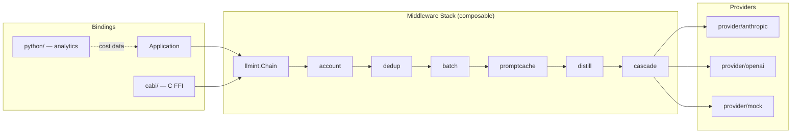

# LLMint

Token economics library for Go. Provider abstractions, composable middleware for caching, cascading, dedup, batching, and distillation, with built-in cost tracking. Pure library -- no binaries.

## Architecture



## Install

```bash
go get github.com/chitinhq/llmint
```

Requires Go 1.18+. Zero external dependencies -- the library is pure Go.

## Core Types

| Type | Purpose |
|------|---------|
| `Provider` | Interface every LLM backend implements (`Complete`, `Name`, `Models`) |
| `Middleware` | `func(Provider) Provider` -- wraps providers with cross-cutting concerns |
| `Request` / `Response` | Canonical provider-agnostic input/output |
| `ModelInfo` | Per-model pricing: input, output, cache read/write per million tokens |
| `Usage` | Raw token counts + `ComputeCost(ModelInfo)` for USD calculation |
| `Savings` | Per-technique savings record; `TotalSavings()` aggregates a slice |
| `CacheStatus` | `CacheMiss` / `CacheHit` / `CachePartial` |

## Quick Start

```go
import (
    "context"
    "github.com/chitinhq/llmint"
    "github.com/chitinhq/llmint/provider/mock"
    "github.com/chitinhq/llmint/middleware/dedup"
    "github.com/chitinhq/llmint/middleware/cascade"
)

// Basic completion
p := mock.New("claude-3-5-sonnet-20241022", "Hello!")
resp, err := p.Complete(context.Background(), &llmint.Request{
    Model:    "claude-3-5-sonnet-20241022",
    Messages: []llmint.Message{{Role: "user", Content: "Hi"}},
})

// Middleware composition (applied left-to-right, first = outermost)
wrapped := llmint.Chain(logging, rateLimit, cache)(baseProvider)
```

## Middleware

| Package | Purpose |
|---------|---------|
| `middleware/account` | Records usage entries (tokens, cost, duration) to a pluggable `Sink` |
| `middleware/dedup` | Caches responses by request hash; returns `CacheHit` on duplicates |
| `middleware/batch` | Queues requests, flushes on size threshold or time window |
| `middleware/promptcache` | Annotates requests with `cache_control: ephemeral` for provider-side prompt caching |
| `middleware/distill` | Replaces system prompts with shorter distilled equivalents from a `Library` |
| `middleware/cascade` | Escalates through model tiers (cheap to expensive) based on confidence scoring |

### Cascade Example

```go
models := []cascade.Model{
    {Provider: haiku, Name: "haiku", Threshold: 0.8},
    {Provider: sonnet, Name: "sonnet", Threshold: 0.6},
    {Provider: opus, Name: "opus", Threshold: 0},  // always accept
}
p := cascade.New(models, cascade.WithMaxEscalations(2))(nil)
```

## Providers

| Package | Backend |
|---------|---------|
| `provider/anthropic` | Anthropic Messages API (Claude) |
| `provider/openai` | OpenAI Chat Completions API (GPT-4o, etc.) |
| `provider/mock` | Deterministic responses for testing |

## C Bindings

The `cabi/` directory exposes LLMint as a shared library via cgo for use from C, Python, or any FFI-capable language:

```bash
cd cabi && make
```

## Python Analytics

The `python/` directory contains a separate Python package for cost analytics and reporting.

## Development

```bash
go build ./...
go test ./...
golangci-lint run
```

## License

MIT
